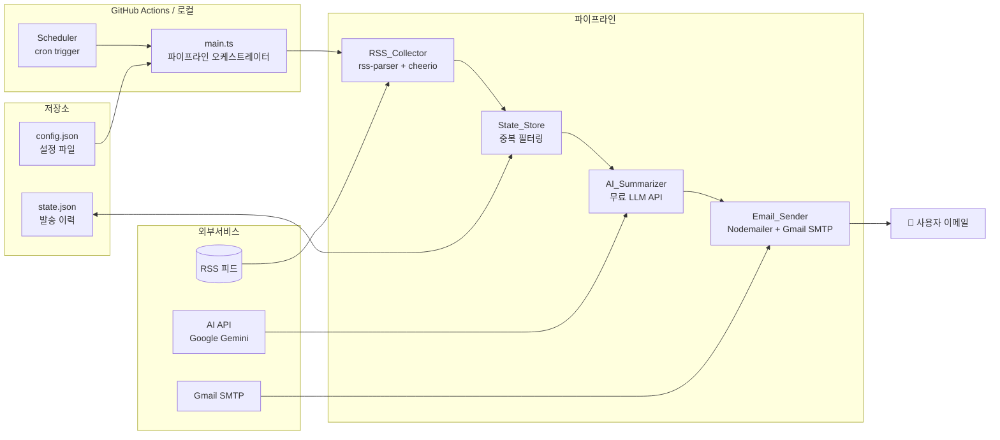
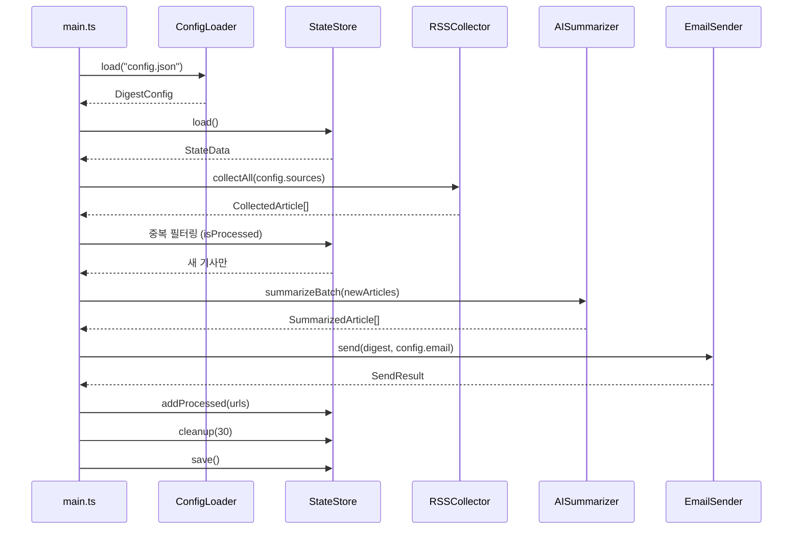

# 설계 문서: 뉴스 요약 이메일 다이제스트

## 개요

뉴스 요약 이메일 다이제스트는 백엔드 서버 없이 동작하는 경량 TypeScript 스크립트 기반 서비스이다. RSS 피드 수집 → AI 요약/번역 → 이메일 발송의 3단계 파이프라인을 단일 스크립트로 실행하며, GitHub Actions 스케줄 워크플로우로 자동화한다.

기존 summary-news 프로젝트의 SaaS 아키텍처와 달리, DB/인증/결제 없이 설정 파일과 경량 상태 저장소만으로 운영되는 개인용 도구이다.

## 아키텍처



### 설계 결정 사항

1. **TypeScript + tsx 실행**: 타입 안전성을 유지하면서 `tsx`로 직접 실행한다. 빌드 단계가 불필요하다.
2. **DB 없이 JSON 파일 상태 관리**: 개인용 서비스이므로 로컬 JSON 파일로 발송 이력을 관리한다. GitHub Actions에서는 캐시로 상태를 유지한다.
3. **Gmail SMTP + Nodemailer**: 무료이고 설정이 간단하다. Google App Password로 인증한다.
4. **Google Gemini API**: 무료 티어(분당 15 요청)로 요약/번역이 가능하다. 실패 시 첫 문장 발췌로 폴백한다.
5. **단일 진입점**: `main.ts` 하나로 전체 파이프라인을 실행한다. 모듈은 분리하되 오케스트레이션은 한 곳에서 한다.

## 컴포넌트 및 인터페이스

### 디렉토리 구조

```
src/
├── main.ts                 # 파이프라인 오케스트레이터 (진입점)
├── collector/
│   └── rss-collector.ts    # RSS 피드 수집 모듈
├── summarizer/
│   └── ai-summarizer.ts    # AI 요약/번역 모듈
├── email/
│   ├── email-sender.ts     # 이메일 발송 모듈
│   └── templates/
│       └── digest.html     # 이메일 HTML 템플릿
├── state/
│   └── state-store.ts      # 상태 저장소 (중복 방지)
├── config/
│   └── config-loader.ts    # 설정 파일 로더/검증
└── types/
    └── index.ts            # 공유 타입 정의
config.json                 # 사용자 설정 파일
state.json                  # 발송 이력 (자동 생성)
.github/
└── workflows/
    └── digest.yml          # GitHub Actions 스케줄
```

### 컴포넌트 인터페이스

```typescript
// === config-loader.ts ===
interface ConfigLoader {
  load(path: string): DigestConfig;
  validate(config: unknown): DigestConfig; // 검증 실패 시 에러 throw
}

// === rss-collector.ts ===
interface RSSCollector {
  collectAll(sources: FeedSource[]): Promise<CollectedArticle[]>;
  collectFeed(source: FeedSource): Promise<CollectedArticle[]>;
  extractContent(url: string): Promise<string>; // HTML → 텍스트
}

// === ai-summarizer.ts ===
interface AISummarizer {
  summarize(article: CollectedArticle): Promise<SummarizedArticle>;
  summarizeBatch(articles: CollectedArticle[]): Promise<SummarizedArticle[]>;
}

// === email-sender.ts ===
interface EmailSender {
  send(digest: Digest, recipient: string): Promise<SendResult>;
  buildHtml(digest: Digest): string;
}

// === state-store.ts ===
interface StateStore {
  load(): StateData;
  save(state: StateData): void;
  isProcessed(url: string): boolean;
  addProcessed(urls: string[]): void;
  cleanup(maxAgeDays: number): void;
}

// === main.ts (오케스트레이터) ===
// 1. config 로드 → 2. state 로드 → 3. RSS 수집 → 4. 중복 필터링
// → 5. AI 요약 → 6. 이메일 발송 → 7. state 업데이트 → 8. 로그 출력
```

### 컴포넌트 간 데이터 흐름



## 데이터 모델

```typescript
// === 설정 관련 ===
interface DigestConfig {
  sources: FeedSource[];
  email: EmailConfig;
  ai: AIConfig;
  schedule?: string; // cron 표현식 (참고용)
}

interface FeedSource {
  name: string;           // 소스 표시명 (예: "TechCrunch")
  feedUrl: string;        // RSS 피드 URL
  category: string;       // 카테고리 (예: "tech", "world")
  contentSelector?: string; // 본문 추출 CSS 셀렉터 (선택)
}

interface EmailConfig {
  to: string;             // 수신 이메일 주소
  from?: string;          // 발신자 표시명
}

interface AIConfig {
  provider: "gemini";
  model?: string;         // 모델명 (기본: "gemini-2.0-flash")
  language: string;       // 요약 언어 (기본: "ko")
}

// === 기사 관련 ===
interface CollectedArticle {
  title: string;
  url: string;
  source: string;         // FeedSource.name
  category: string;
  content: string;        // 본문 텍스트
  publishedAt: Date;
}

interface SummarizedArticle extends CollectedArticle {
  summary: string;        // AI 요약 결과 (한국어)
  translatedTitle: string; // 번역된 제목 (한국어)
  isFallback: boolean;    // 폴백 요약 여부
}

// === 다이제스트 ===
interface Digest {
  articles: SummarizedArticle[];
  generatedAt: Date;
  stats: DigestStats;
}

interface DigestStats {
  totalCollected: number;
  totalNew: number;
  summarizeSuccess: number;
  summarizeFallback: number;
  summarizeFailed: number;
}

// === 상태 관련 ===
interface StateData {
  processedArticles: ProcessedEntry[];
  lastRunAt?: string;     // ISO 8601
}

interface ProcessedEntry {
  url: string;
  processedAt: string;    // ISO 8601
}

// === 이메일 결과 ===
interface SendResult {
  success: boolean;
  messageId?: string;
  error?: string;
  attempts: number;
}
```

### 설정 파일 예시 (config.json)

```json
{
  "sources": [
    {
      "name": "Fox News - Latest",
      "feedUrl": "https://moxie.foxnews.com/google-publisher/latest.xml",
      "category": "general"
    },
    {
      "name": "Fox News - World",
      "feedUrl": "https://moxie.foxnews.com/google-publisher/world.xml",
      "category": "world"
    },
    {
      "name": "Fox News - Politics",
      "feedUrl": "https://moxie.foxnews.com/google-publisher/politics.xml",
      "category": "politics"
    },
    {
      "name": "Fox News - Tech",
      "feedUrl": "https://moxie.foxnews.com/google-publisher/tech.xml",
      "category": "tech"
    }
  ],
  "email": {
    "to": "user@example.com",
    "from": "News Digest"
  },
  "ai": {
    "provider": "gemini",
    "language": "ko"
  }
}
```

### 상태 파일 예시 (state.json)

```json
{
  "processedArticles": [
    {
      "url": "https://techcrunch.com/2024/01/15/example-article",
      "processedAt": "2024-01-15T09:00:00Z"
    }
  ],
  "lastRunAt": "2024-01-15T09:00:00Z"
}
```

## 정확성 속성 (Correctness Properties)

*속성(property)이란 시스템의 모든 유효한 실행에서 참이어야 하는 특성 또는 동작이다. 사람이 읽을 수 있는 명세와 기계가 검증할 수 있는 정확성 보장 사이의 다리 역할을 한다.*

### Property 1: 설정 파싱 round-trip

*For any* 유효한 DigestConfig 객체, JSON으로 직렬화한 뒤 다시 파싱하면 원본과 동일한 DigestConfig 객체를 반환해야 한다.

**Validates: Requirements 4.1**

### Property 2: 설정 검증 — 유효/무효 분류

*For any* 설정 객체에 대해, 필수 필드(sources 배열에 최소 1개 항목, email.to 존재)가 모두 있으면 검증이 성공하고, 하나라도 누락되면 검증이 실패하며 구체적인 에러 메시지를 포함해야 한다.

**Validates: Requirements 4.2, 4.3**

### Property 3: RSS 수집 결과 필수 필드 존재

*For any* 유효한 RSS XML 피드에서 수집된 기사에 대해, 결과 CollectedArticle 객체는 반드시 title, url, publishedAt, source 필드를 포함해야 한다.

**Validates: Requirements 1.1, 1.2**

### Property 4: HTML 본문 추출 시 태그 제거

*For any* HTML 문자열에서 본문을 추출할 때, 결과 텍스트에는 HTML 태그(`<...>`)가 포함되지 않아야 하며, 원문의 텍스트 콘텐츠는 보존되어야 한다.

**Validates: Requirements 1.5**

### Property 5: 중복 필터링 — 처리된 URL 제외

*For any* 기사 목록과 이미 처리된 URL 집합에 대해, 중복 필터링 후 결과에는 이미 처리된 URL이 포함되지 않아야 하며, 처리되지 않은 기사는 모두 포함되어야 한다.

**Validates: Requirements 1.3, 6.2**

### Property 6: AI 폴백 요약이 원문 앞부분과 일치

*For any* 기사 본문에 대해, AI API 실패 시 폴백 요약은 원문의 첫 2~3문장을 정확히 발췌한 것이어야 한다.

**Validates: Requirements 2.4**

### Property 7: Digest HTML에 모든 기사의 필수 정보 포함

*For any* SummarizedArticle 목록으로 생성된 Digest HTML에 대해, 각 기사의 제목, 요약 내용, 원문 URL, 소스명, 발행일이 모두 HTML 출력에 포함되어야 한다.

**Validates: Requirements 3.2**

### Property 8: 상태 저장소 round-trip

*For any* 유효한 StateData 객체, 저장(save) 후 로드(load)하면 원본과 동일한 StateData 객체를 반환해야 한다.

**Validates: Requirements 6.1**

### Property 9: 상태 저장소 insert/contains

*For any* URL 목록을 상태 저장소에 추가(addProcessed)한 후, 각 URL에 대해 isProcessed가 true를 반환해야 한다.

**Validates: Requirements 6.3**

### Property 10: 상태 정리 — 날짜 기반 필터링

*For any* 다양한 날짜를 가진 ProcessedEntry 목록에 대해, cleanup(30) 실행 후 30일 이상 된 항목은 제거되고, 30일 미만 항목은 모두 유지되어야 한다.

**Validates: Requirements 6.4**

## 에러 핸들링

### RSS 수집 에러

| 에러 상황 | 처리 방식 |
|----------|----------|
| RSS 피드 파싱 실패 (네트워크, 잘못된 XML) | 해당 소스 건너뛰기, 에러 로그 기록, 나머지 소스 계속 수집 |
| 본문 크롤링 실패 (403, 타임아웃) | RSS 피드의 description 필드를 본문으로 대체 |
| 모든 소스 수집 실패 | 에러 로그 기록, 빈 Digest로 이메일 발송하지 않음 |

### AI 요약 에러

| 에러 상황 | 처리 방식 |
|----------|----------|
| API 호출 실패 (네트워크, 429, 500) | 기사 첫 2~3문장 발췌로 폴백, isFallback=true 표시 |
| API 응답 파싱 실패 | 동일하게 폴백 처리 |
| 모든 기사 요약 실패 | 모든 기사를 폴백 요약으로 처리하여 Digest 구성 |

### 이메일 발송 에러

| 에러 상황 | 처리 방식 |
|----------|----------|
| SMTP 연결 실패 | 최대 3회 재시도 (1초, 2초, 4초 간격) |
| 인증 실패 | 즉시 실패, 에러 로그 기록 (재시도 불필요) |
| 3회 재시도 모두 실패 | 에러 로그 기록, 비정상 종료 코드 반환 |

### 설정/상태 에러

| 에러 상황 | 처리 방식 |
|----------|----------|
| 설정 파일 없음 | 구체적 에러 메시지 출력, 즉시 종료 |
| 설정 파일 검증 실패 | 누락 필드 명시, 즉시 종료 |
| 상태 파일 없음 | 빈 상태로 초기화 (첫 실행으로 간주) |
| 상태 파일 손상 | 빈 상태로 초기화, 경고 로그 기록 |

## 테스트 전략

### 테스트 프레임워크

- **단위 테스트**: Vitest
- **속성 기반 테스트**: fast-check (Vitest와 통합)
- **테스트 실행**: `vitest --run` (단일 실행 모드)

### 속성 기반 테스트 (Property-Based Tests)

각 correctness property를 fast-check로 구현한다. 최소 100회 반복 실행한다.

| Property | 테스트 대상 모듈 | 생성기 |
|----------|----------------|--------|
| P1: 설정 파싱 round-trip | config-loader | 임의의 DigestConfig 객체 |
| P2: 설정 검증 | config-loader | 필수 필드가 랜덤하게 누락된 설정 객체 |
| P3: RSS 필수 필드 | rss-collector | 임의의 RSS XML 문자열 |
| P4: HTML 태그 제거 | rss-collector (extractContent) | 임의의 HTML 문자열 |
| P5: 중복 필터링 | state-store + 필터 로직 | 임의의 기사 목록 + URL 집합 |
| P6: 폴백 요약 | ai-summarizer | 임의의 기사 본문 텍스트 |
| P7: Digest HTML 필수 정보 | email-sender (buildHtml) | 임의의 SummarizedArticle 목록 |
| P8: 상태 round-trip | state-store | 임의의 StateData 객체 |
| P9: 상태 insert/contains | state-store | 임의의 URL 목록 |
| P10: 상태 정리 | state-store (cleanup) | 임의의 날짜를 가진 ProcessedEntry 목록 |

각 테스트에는 다음 형식의 태그 주석을 포함한다:
```
// Feature: news-email-digest, Property N: [속성 제목]
```

### 단위 테스트 (Unit Tests)

속성 테스트와 상호 보완적으로, 특정 예시와 엣지 케이스를 단위 테스트로 검증한다:

- RSS 피드 파싱 실패 시 나머지 소스 계속 수집 (요구사항 1.4)
- 이메일 발송 3회 재시도 로직 (요구사항 3.5)
- 파이프라인 실행 로그 출력 (요구사항 5.3)
- 치명적 오류 시 비정상 종료 코드 (요구사항 5.4)
- 상태 파일 없을 때 빈 상태 초기화
- 설정 파일 검증 실패 시 구체적 에러 메시지
